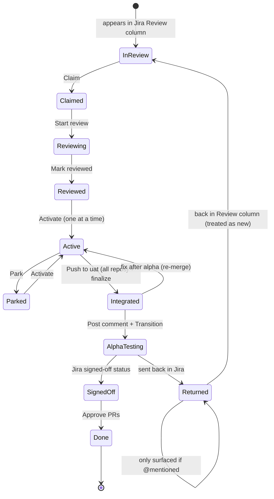
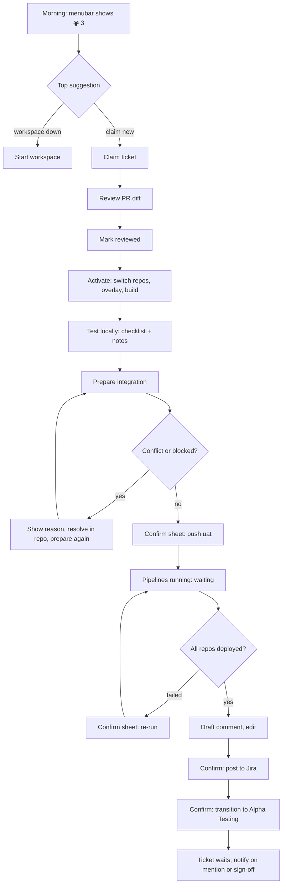
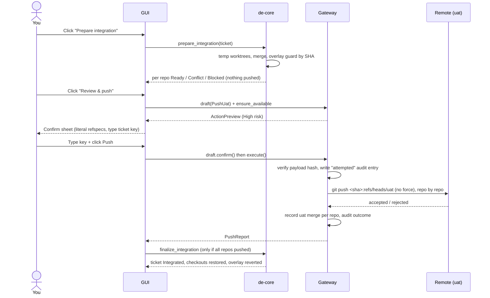
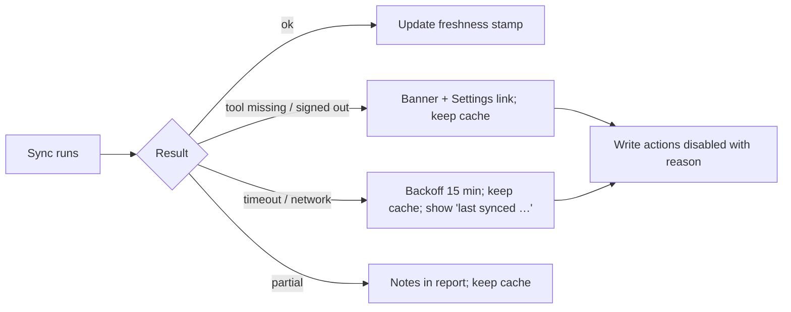

# GUI design outline

Status: **design only, nothing built.** This is the outline for milestones M7 (menubar app) and M8 (in-app review). Wireframes are ASCII on purpose: they fix structure and flow, not visuals. Every screen names the core data it renders, so the outline can be checked against what already exists.

## 1. Principles

1. **Thin client.** The GUI renders `de next --json` and calls `de-core`. It has no rules of its own, never builds a command from a string, and never talks to Jira, Bitbucket or a git remote directly.
2. **Suggestions first.** The default view is "what should I do now?", not a database browser. Tickets, PRs and pipelines are reached from a suggestion or from the ticket list.
3. **Every external write is a previewed, confirmed action.** The GUI shows the gateway's exact preview (`ActionPreview`) and calls `Draft::confirm()` **only from a real click**. There is no "don't ask again", no bulk confirm, no auto-post.
4. **One active ticket.** The UI makes the active ticket impossible to miss and makes switching a deliberate act (park, then activate).
5. **Honest freshness.** Everything from Jira or Bitbucket is cached data. Every list shows how old it is and whether the last sync failed. Offline is a normal state, not an error.
6. **Reasons, not just buttons.** Each suggestion shows why it exists (`reason`), so a wrong one can be dismissed with confidence.

## 2. Surfaces

```
Menubar item (always on)
  └─ Popover ................. glance: what's next, sync health, one-click actions
       └─ "Open de" ........ Main window (on demand)
                              ├─ Next ........... ranked suggestions (default)
                              ├─ Tickets ........ Review queue · Active · Parked · Awaiting alpha · Done
                              ├─ Ticket ......... detail with tabs (Overview · Review · Test · Ship · Timeline)
                              ├─ Workspace ...... services up/down, repo status
                              └─ Settings ....... providers health, Jira mapping, repos, audit log
Modal sheets: Confirm-write · Choose-baseline · Activation-progress · Discard/park
Notifications: macOS notification centre (new suggestion, deploy finished, mentioned)
```

## 3. Screens

### S1. Menubar icon and popover

The icon carries state only; detail lives in the popover.

```
Icon states:   ●  idle, nothing to do        ◐  syncing
               ◉  suggestions waiting (n)    ⚠  a provider is unavailable / signed out
```

```
┌──────────────────────────────────────────────┐
│ de                          synced 2 min ago ↻│
├──────────────────────────────────────────────┤
│ ACTIVE  PROJ-142  Fix login redirect     2h13 │
│         api-client · web ─ overlay on         │
├──────────────────────────────────────────────┤
│ NEXT                                          │
│ ▸ Integrate PROJ-142 to uat                   │
│   checklist complete (6/6)          [ Open ]  │
│ ▸ PROJ-139 pipeline failed on web             │
│   deploy step failed, run #482    [ Re-run…]  │
│ ▸ Claim PROJ-150 (High)                       │
│   in Review, not yet yours         [ Claim ]  │
│                                  3 more ›     │
├──────────────────────────────────────────────┤
│ Workspace: shop  ● 4/4 services up   [ Stop ] │
│ Open de                              ⌘O       │
└──────────────────────────────────────────────┘
```

- Data: `de next --json` (`state` open/resurfaced, top 3 to 5 by `rank`), the active ticket (`tickets::active`), time (`time::total_seconds`), workspace status (Compose), sync freshness (`sync_state`).
- A `[ Re-run… ]` style button always ends in the Confirm sheet (S9); it never acts directly.
- `automatic` suggestions (sync) have no button: the app just does them.

### S2. Main window: shell

```
┌────────────────────────────────────────────────────────────────────────────┐
│ ◀ ▶  de · shop                          ⌕ Search or jump (⌘K)      ↻  ⚙   │
├───────────────┬────────────────────────────────────────────────────────────┤
│ NEXT        3 │                                                            │
│               │                  (content of selected item)                │
│ TICKETS       │                                                            │
│  Review    12 │                                                            │
│  Active     1 │                                                            │
│  Parked     2 │                                                            │
│  Awaiting   4 │                                                            │
│  Done         │                                                            │
│               │                                                            │
│ WORKSPACE     │                                                            │
│  Services     │                                                            │
│  Repos        │                                                            │
│               │                                                            │
│ ⚠ bkt signed  │                                                            │
│   out         │                                                            │
└───────────────┴────────────────────────────────────────────────────────────┘
```

- Sidebar counts come from `LocalStatus` groups plus the cached Review-column pool. "Awaiting" is `Integrated` (on `uat`, waiting for alpha/UAT).
- A persistent footer chip shows provider problems (`Health`, `sync` report) and links to Settings.
- Command palette (⌘K): jump to ticket by key, run a suggestion, start/stop workspace.

### S3. Next (default view)

```
┌────────────────────────────────────────────────────────────────────────────┐
│ Next                                    ☐ show dismissed / snoozed   sync ↻│
├────────────────────────────────────────────────────────────────────────────┤
│ ① ● HOTFIX  PROJ-139  Deploy failed on web                                 │
│    The deploy step of run #482 failed after your push to uat.              │
│    [ View pipeline ]  [ Re-run… ]                    Snooze ▾  Dismiss     │
├────────────────────────────────────────────────────────────────────────────┤
│ ②   PROJ-142  Integrate to uat                                             │
│    Active ticket, checklist complete (6 of 6). 2 repos touched.            │
│    [ Prepare integration ]                           Snooze ▾  Dismiss     │
├────────────────────────────────────────────────────────────────────────────┤
│ ③   PROJ-150  Claim                                                        │
│    In the Review column, priority High, 3rd in your queue.                 │
│    [ Claim ]                                         Snooze ▾  Dismiss     │
├────────────────────────────────────────────────────────────────────────────┤
│ ④ ⓘ PROJ-131  You were mentioned                                           │
│    "Jane Doe: can you re-check the redirect on staging?" 4 h ago           │
│    [ Open ticket ]                                   Snooze ▾  Dismiss     │
└────────────────────────────────────────────────────────────────────────────┘
```

Suggestion card anatomy (reused everywhere):

```
┌───────────────────────────────────────────────────────────┐
│ ⑦  [badges]  KEY  Title of the suggestion                  │  rank · hotfix/informational badges
│    reason: one or two sentences stating the facts          │  ← `reason`
│    [ primary action ]  [ secondary ]     Snooze ▾  Dismiss │  ← by `level` and `action.type`
└───────────────────────────────────────────────────────────┘
```

| `level` | Control | Behaviour |
|---|---|---|
| `automatic` | none (or a passive "waiting…" line) | the app runs it itself (sync), no card action |
| `local_one_click` | a button | asks a light confirm (what will change locally), then runs the core executor |
| `confirmed_external` | a button labelled with an ellipsis | opens the Confirm sheet (S9); nothing is sent until the user confirms there |

`informational: true` cards have links only (open ticket, open pipeline, resolve conflict guidance). Dismiss and Snooze write `suggestion_responses`; a changed facts hash resurfaces a dismissed card (state `resurfaced`, marked with a small dot).

### S4. Tickets list

```
┌────────────────────────────────────────────────────────────────────────────┐
│ Review (12)      Active (1)      Parked (2)      Awaiting alpha (4)   Done  │
├────────────────────────────────────────────────────────────────────────────┤
│ ⠿ PROJ-150  High     Fix header overflow          in Review   unclaimed    │
│ ⠿ PROJ-142  Medium   Fix login redirect           ▶ ACTIVE    api-client web│
│ ⠿ PROJ-139  Highest  Payment retry     HOTFIX     parked      web          │
│ ⠿ PROJ-131  Low      Returned: staging redirect   returned    @you         │
├────────────────────────────────────────────────────────────────────────────┤
│ ⠿ = drag handle (manual order, persisted)      ordering: Jira priority, then│
│                                                your manual order            │
└────────────────────────────────────────────────────────────────────────────┘
```

- Data: `jira_cache::list_views` (cache joined with tracking), manual order (`tickets::reorder`), derived kind (`sync::ticket_kind`: hotfix badge with its reason on hover).
- The Review tab is the pool from the Review column; a row without a tracking record shows a `Claim` button.

### S5. Ticket detail: shell and Overview tab

```
┌────────────────────────────────────────────────────────────────────────────┐
│ PROJ-142  Fix login redirect                        status: ▶ Active       │
│ Jira: In Review · High · assigned Jane Doe          time 2h13  ⏱  Park  ⋯  │
├────────────────────────────────────────────────────────────────────────────┤
│  Overview   Review   Test   Ship   Timeline                                 │
├────────────────────────────────────────────────────────────────────────────┤
│ REPOS                                                                       │
│  repo         branch                        PR            deploy            │
│  api-client   feature/PROJ-142-redirect     #212 open     ● deployed alpha  │
│  web          feature/PROJ-142-web          #488 open     ◐ running  #482   │
│  worker       develop (baseline)            ─             ─ not touched     │
│  docs         master  (baseline)            ─             ─ not touched     │
│  [ + link repo ]   [ exclude ]   ⚠ web: 2 candidate branches, choose one    │
│                                                                              │
│ NEXT FOR THIS TICKET                                                        │
│  ▸ Wait: pipeline running for web (#482)                                    │
│                                                                              │
│ NOTES                                                                       │
│  (free text, autosaved)                                                     │
└────────────────────────────────────────────────────────────────────────────┘
```

- Data: `ticket_repos` links (auto, manual, excluded), activation restore records (which repos are on ticket branch vs baseline), cached `prs`, `deploy_status` (states `NotPushed · Pending · Running · Deployed · Failed · Untracked`), suggestions filtered to this ticket.
- Ambiguous branches (several matches, no manual choice) block activation, so the warning row offers the choice inline (`links::add_manual`).

### S6. Test tab (local test of the active ticket)

```
┌────────────────────────────────────────────────────────────────────────────┐
│ CHECKLIST                                               6 of 6  ✓ complete   │
│  ☑ Login redirect goes to /dashboard                                        │
│  ☑ Logout clears session                                                    │
│  ☐ + add item                                                               │
│                                                                              │
│ ENVIRONMENT                                                                 │
│  ▶ Activated 2h13 ago                                                       │
│  api-client  on feature/PROJ-142-redirect  ·  stash: none                   │
│  web         on feature/PROJ-142-web      ·  stash "de:PROJ-142:web"        │
│  ⚡ Test overlay applied in web (composer path → ../api-client, "*")         │
│     rebuild: build-ui ✓                                                     │
│                                                                              │
│ NOTES  (saved)                                                              │
│  [ Park ]   [ Finish testing ▾ ]                                            │
└────────────────────────────────────────────────────────────────────────────┘
```

- Data: checklist and notes (`notes`), restore records and overlay backups (`restore`, `overlays`), time entry.
- **Park / Deactivate** opens the Activation-progress sheet (S8) in reverse; hand edits to composer files saved as `*.de-edited` are listed in its result.
- The overlay row is the safety indicator: red while it must not be pushed, green once reverted.

### S7. Ship tab (integrate, deploy, announce)

A single vertical stepper: each step shows its state and the one thing to do next.

```
┌────────────────────────────────────────────────────────────────────────────┐
│ ① Integrate to uat        ● ready                                          │
│    api-client   merge ready    +3 commits  4 files   uat before → after     │
│    web          merge ready    +5 commits  9 files                          │
│    ⚠ nothing is pushed until you confirm                                    │
│    [ Refresh preparation ]                       [ Review & push to uat… ]   │
│                                                                              │
│ ② Pipelines               ◐ waiting                                        │
│    api-client   ● deployed to alpha   run #311                              │
│    web          ◐ running             run #482   step "Deploy alpha"        │
│                                                                              │
│ ③ Deploy comment          ─ available when all repos are deployed           │
│    Draft preview (editable):                                                │
│      Deployed to alpha:                                                     │
│      • api-client PR #212 · pipeline #311 · https://…                       │
│      • web        PR #488 · pipeline #482 · https://…                       │
│    [ Post to Jira… ]                                                        │
│                                                                              │
│ ④ Move ticket             ─ after the comment is posted                     │
│    In Review → Alpha Testing                     [ Transition… ]            │
│                                                                              │
│ ⑤ After alpha             ─ tracks sign-off; new commits → “re-merge”       │
└────────────────────────────────────────────────────────────────────────────┘
```

- Data: `IntegrationPrep` (`RepoOutcome`: Ready, UpToDate, AlreadyPushed, Conflict, Blocked), `deploy_status`, `drafts` (Draft, Posted, Discarded), configured alpha status.
- Blocked and conflicting repos show the reason inline (conflicting files, overlay leak with commit and line, diverged local `uat`, invalid remote or branch name). The push button stays disabled while any repo is blocked.
- Steps ①, ③, ④ end in the Confirm sheet (S9). "Re-run pipeline" on a failed run also does.
- A resumed finalize (pushes done, restore incomplete) shows a banner and a single `Finish` action that never pushes again.

### S8. Sheets for local operations

```
Choose baseline (hotfix only)                  Activation progress
┌──────────────────────────────────────┐      ┌──────────────────────────────────────┐
│ PROJ-139 is a hotfix                 │      │ Activating PROJ-142                  │
│ Untouched repos should run on:       │      │  api-client  ✓ switched              │
│  ○ master   (production)             │      │  web         ✓ switched · stashed    │
│  ● develop                           │      │              ✓ overlay · ◐ build-ui  │
│  ○ uat                               │      │  worker      ○ waiting               │
│ Applies to this activation only.     │      │  docs        ○ waiting               │
│            [ Cancel ]  [ Activate ]  │      │  ⚠ on failure everything is rolled   │
└──────────────────────────────────────┘      │    back; you'll see exactly what     │
                                              └──────────────────────────────────────┘
```

- Progress lines map one to one to the activation report (per-repo action, warnings such as "baseline diverged, not fast-forwarded", stash labels).
- A failure shows what was rolled back and anything that could not be (the ticket stays recoverable; this sheet offers `Retry deactivate`).

### S9. Confirm sheet (the gateway preview) - the most important component

Every external write uses this one sheet.

```
┌────────────────────────────────────────────────────────────────────────────┐
│ ⛔ HIGH RISK   Push to uat                                       PROJ-142   │
├────────────────────────────────────────────────────────────────────────────┤
│ This will run, exactly:                                                     │
│   api-client   git push origin 3f2a9c1:refs/heads/uat                       │
│   web          git push origin 91be7d4:refs/heads/uat                       │
│                                                                              │
│ api-client   uat 8c01d22 → 3f2a9c1   3 commits · 4 files      [ show diff ] │
│ web          uat 44ab0f9 → 91be7d4   5 commits · 9 files      [ show diff ] │
│                                                                              │
│ Checks passed:  overlay guard ✓ (by SHA)   no overlay in worktree ✓        │
│ Pushing deploys to alpha.                                                   │
│                                                                              │
│ Type PROJ-142 to confirm:  [ __________ ]                                   │
│                              [ Cancel ]   [ Push to uat ]  (disabled)       │
└────────────────────────────────────────────────────────────────────────────┘
```

Rules for this sheet:

- Shows the **literal payload** from `ActionPreview` (comment body verbatim, transition target, exact git refspecs). If the payload differs at execute time the gateway refuses; the sheet then reports "changed since preview, nothing was sent".
- `Risk::High` (push `uat`) requires typing the ticket key. `Medium` and `Low` need one explicit click. No default-focused destructive button; Escape cancels.
- Calls `ensure_available` first: if the writer's tool is missing or signed out, the sheet is replaced by "Cannot send: `bkt` is signed out" with the fix, before anyone is asked to confirm.
- After sending: result (per-repo `Pushed`, `AlreadyPushed`, `Rejected`, `Blocked`, `Failed`), audit id, and any `audit_warnings`. A rejected push (uat moved) offers `Prepare again`, never a blind retry.
- Comment posts show the draft in an editable field **before** the sheet; the sheet itself is read-only.

### S10. Review tab and full review (M8)

```
┌────────────────────────────────────────────────────────────────────────────┐
│ Review · PROJ-142     [ api-client #212 ▾ ]   into develop   ✓ 1 approval   │
├──────────────────┬─────────────────────────────────────────────────────────┤
│ FILES  (9)       │  src/redirect.rs                          unified │ split│
│ ▾ src            │  ─────────────────────────────────────────────────────  │
│   ● redirect.rs  │   41   fn target(user: &User) -> Url {                   │
│   ● session.rs   │   42 -     Url::parse("/home").unwrap()                  │
│   ○ mod.rs       │   42 +     user.landing().unwrap_or_default()            │
│ ▾ tests          │   43   }                                                 │
│   ● redirect_t…  │        ┌ Jane Doe · inline comment ─────────────────┐    │
│                  │        │ Why not fall back to /home?                │    │
│ ☐ viewed         │        │ [ Reply ]  [ Resolve ]                     │    │
│                  │        └────────────────────────────────────────────┘    │
│ Comments (3)     │                                                          │
│ [ Request changes… ] [ Approve… ] (approve enabled only after sign-off)     │
└──────────────────┴─────────────────────────────────────────────────────────┘
```

- The diff is the **PR's own**: source against the PR's *destination* branch (develop normally, master/main for a hotfix), computed from local git objects with three-dot semantics (`GitRepo::diff`), so nothing is checked out.
- One tab per touched repo. "Viewed" state is local. Marking the ticket reviewed (`ticket_reviews`) is a local one-click.
- Inline comment: click a line, write, the Confirm sheet shows the comment and its anchor (path, line, side). If `bkt` cannot post inline for a case it fails loudly and never posts a general comment instead.
- **Approve is disabled until the ticket is in a signed-off status** (config `signed_off`, default the Done statuses), with the reason shown next to the button.
- Own diff renderer (Zed's diff code is GPL-3, `de` is MIT). Syntax highlighting from Tree-sitter via the editor component.

### S11. Timeline tab

```
┌────────────────────────────────────────────────────────────────────────────┐
│ 10:42  git.push_uat            ✓ api-client, web            (you confirmed) │
│ 10:41  git.push_uat.attempted  payload: 2 repos, SHAs …                    │
│ 10:15  activation.complete     api-client, web, worker, docs               │
│ 09:58  links.discovered        api-client ✓  web ⚠ 2 candidates            │
│ …                                                            [ export ]     │
└────────────────────────────────────────────────────────────────────────────┘
```

- The append-only audit log for this ticket, newest first; `attempted` and outcome pairs are grouped. Read-only.

### S12. Workspace

```
┌────────────────────────────────────────────────────────────────────────────┐
│ Workspace shop                                    [ Start ]  [ Stop ▾ ]     │
│  service order (depends_on):  db → api → web                                │
│  project      services   branch                     state                   │
│  api-client   3          feature/PROJ-142-redirect  ● up · clean            │
│  web          2          feature/PROJ-142-web       ● up · ⚡ overlay        │
│  worker       1          develop                    ● up · 1 modified        │
│  ⚠ Stop will warn: web has uncommitted changes, worker has 2 unpushed       │
└────────────────────────────────────────────────────────────────────────────┘
```

- Start and stop keep the CLI's semantics (dependency order, the uncommitted/unpushed guard becomes a confirm sheet).
- Data: `ordered_projects`, `RepoStatus` (modified, staged, untracked, ahead, behind), Compose.

### S13. Settings

```
Providers                          Jira mapping                    Data
 acli   ● ready   v1.3.39           review status  [ In Review ]    state.db   …/state.db   [ reveal ]
 bkt    ⚠ signed out                alpha status   [ Alpha Testing ] cache.db   …/cache.db   [ reset cache ]
        run: bkt auth login         returned       [ Returned ]     audit log  view / export
        then: bkt context use …     signed off     [ Done ]
 [ Re-check ]  [ Diagnose… ]        review JQL     [ …………… ]         Repos
                                    my account id  [ …………… ]         per repo: Bitbucket repo, base/prod/uat
                                                                      branches, composer overlay, checks
```

- **Diagnose** runs `de providers probe` and shows the raw output with the privacy warning (the output can contain ticket titles).
- Never displays or stores tokens; the tools own their logins.
- `reset cache` deletes `cache.db` only, never `state.db`.

## 4. Flows

### F1. Ticket lifecycle as the UI presents it



Approval is only offered from `SignedOff`. `Integrated` is set only by the finalize step after a successful push, never by a button.

### F2. A day, seen through the menubar



### F3. Push to `uat` (sequence, the most dangerous action)



### F4. Offline and signed-out behaviour



Reads always work from cache. Writes are disabled with an explanation when their tool is unavailable, before any confirmation is requested.

## 5. Component templates

| Component | Used in | Contents |
|---|---|---|
| Suggestion card | Next, popover, ticket detail | rank, badges, key, title, reason, primary and secondary action, snooze, dismiss |
| Ticket row | Tickets, search | drag handle, key, priority, title, kind badge, status pill, repo chips |
| Repo row | Overview, Ship, Workspace | repo, branch (ticket or baseline), PR chip, deploy state, warnings |
| Status pill | everywhere | local status; Jira status shown separately in a lighter style |
| Deploy chip | Overview, Ship | `NotPushed · Pending · Running · Deployed · Failed · Untracked` with run number and link |
| Risk banner | Confirm sheet | Low / Medium / High styling, with the "what this does" sentence |
| Freshness stamp | list headers | "synced 2 min ago", warning colour when a source failed |
| Diff viewer | Review | file tree, unified/split, inline comment thread, viewed checkbox |
| Progress list | Activation, integration | per-repo step, spinner, check, warning, rollback report |
| Empty state | every list | one sentence and one action (e.g. "Nothing to do. Sync now.") |

## 6. Data each screen needs

| Screen | Reads | Writes (all local unless marked) |
|---|---|---|
| Popover, Next | `de next --json` (v1), active ticket, sync freshness | dismiss/snooze/done responses |
| Tickets | `jira_cache`, `tickets`, derived kind | claim, reorder, status changes through the activation and finalize functions only |
| Overview | links, PRs, deploy status, restore records | add/exclude links |
| Test | checklist, notes, restore records, overlays, time | checklist, notes, time |
| Ship | `IntegrationPrep`, `deploy_status`, drafts | drafts (local); **PushUat, PostJiraComment, TransitionJira via the gateway** |
| Review | local git diffs, cached PR comments | review marker (local); **PostPrComment, ApprovePr, RequestChanges via the gateway** |
| Timeline | audit log | none |
| Workspace | Compose, `RepoStatus` | start/stop |
| Settings | config, provider health, probe | config edits, cache reset |

## 7. Notifications

Only for things that need a human and were not caused by the user's last action:

- A new suggestion with `priority` in the blocking or review band (failed deploy, conflict, returned and mentioned, new review request).
- A deploy finishing for a ticket you pushed (deployed, or failed).
- A mention on a Returned ticket.

Never for `automatic` items or informational waits. Clicking a notification opens the matching suggestion. Quiet hours and per-rule toggles live in Settings. (Open question 10 in GOAL.md.)

## 8. Keyboard

`⌘K` palette · `⌘O` open main window from the popover · `J/K` move in lists · `Return` primary action · `E` dismiss · `S` snooze · `⌘Return` never confirms a write (confirmation needs a deliberate click, and the typed key for High risk).

## 9. Mapping to `gpui-kit` (to verify in the spike, not assumed)

| Need | Candidate |
|---|---|
| Sidebar + resizable panes + tabs | dock layout |
| Ticket list, PR list, audit log | virtual list / data table |
| Diff and code | code editor (Tree-sitter; check whether it has a diff mode, otherwise custom) |
| Sheets, confirm dialogs, toasts | overlays |
| Menubar item and popover | **not covered by the kit**: needs a macOS status-item integration outside GPUI, then GPUI content in a popover window |
| `.app` bundle, launch at login | packaging outside `cargo-dist` |

Spike checklist: builds on the pinned toolchain; a window with dock + list; a status-item popover; a diff view with 5k lines; text input for the "type the key" confirm; notification API.

## 10. Empty, error and edge states (each needs a design)

- First run: no config → Settings wizard (providers, Jira mapping, repos), each step with a Check button.
- No tickets in Review, nothing actionable, all synced: calm empty state.
- Provider signed out, missing, or timed out: banner + disabled writes with reason.
- Ambiguous branches for a repo: inline chooser, blocks activation.
- Activation or integration failure: rollback report, `Retry`, never a dead end.
- `uat` moved during a push: rejected result, `Prepare again`.
- A ticket deleted or invisible in Jira: kept locally with a "not found in Jira" badge, not removed.
- Crash recovery: on launch, detect leftover restore records or overlay backups and offer `Finish restoring` before anything else.

## 11. Open design questions

1. **Menubar mechanics:** GPUI has no status-item API; is a small native shim acceptable, or should the menubar be a separate helper process launching the main window?
2. **High-risk confirm:** type-the-key vs hold-to-confirm for the `uat` push. Proposed: type the key.
3. **Density:** default to a compact list (many tickets) or comfortable cards? Proposed: compact rows in lists, cards only in Next.
4. **Review location:** a tab in the ticket detail (proposed) vs its own window for long reviews.
5. **Diff:** unified by default with a split toggle; is per-file "viewed" enough, or do you want per-hunk?
6. **Theming:** follow system light/dark only.
7. **Popover size:** fixed height with a "more" link (proposed) vs scrolling.
8. **Where does the workspace start/stop live** when no ticket is active: popover footer (proposed) plus the Workspace screen.
9. **Approve UI for hotfixes:** same rule (only after sign-off) or a shortcut?
